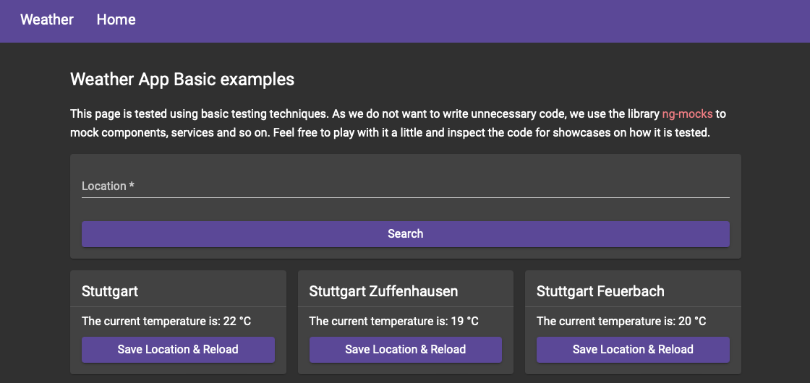

= Cloud Native Testing: Angular

This showcase demonstrates the basics of writing efficient automated tests for Angular frontend applications. We will further grow this repository to cover more advanced testing approaches in the future.

== Examples

* General Principles
** link:apps/basics[Basic Unit and Integration Testing]
** link:apps/basics-e2e[Basic End-to-End-Testing]

== Testing Basics with Angular, Jest and Cypress:

There are discussions about testing pyramids vs testing trophies vs testing honeycombs. And I am sure there are plenty more models we could refer to. Let's skip those discussions and focus on the important principles we should follow when testing:

1. Clear boundaries: Our tests should focus on a specific scope within our application.
    - A single component to test its rendering and the edge cases of it's rendering logic.
    - A service to validate that our APIs are consumed correctly.
    - A page to validate, that our components and services integrate into a working unit offering the functionality required.
    - A specific workflow in our application to validate that changes do not mess with them.

2. Time Preserving: We should test our code in a way that is fast to write, easy to maintain and most importantly quickly executed. This thought saves us a lot of time in the long as we do not lose a lot of time when running our builds or refactoring some parts of our application. This has some effects:
    - We should consider the lowest level of test that can give us certainty in regard to the aspect we want to test.
    - To achieve lower test levels, we have to ensure that we know the boundaries of the test that will be written.
    - We can speed up our execution times by extracting dependencies. I.e. replace a real browser with the JSDom or mock our Rest API instead of bootstrapping the backend.

3. Reliability: Your tests only fail if something actually broke within your app. If your tests fail randomly, you can not trust your test suite.

4. Failing for actual reasons: If your tests break because you renamed a CSS class that is not helpful as it will increase your maintenance effort. If your tests fail because a dependency way down the component tree changed, that will lead to a trickle up effect with high maintenance cost as well. If your test fails because you removed a button, that's good.

== What we can use to achieve those goals

Testing our applications is done at different levels. The specification of those levels (both in number and delimitation to each other) are project specific. For a baseline we use the common ones with unit, integration and end-to-end testing enriched by static analysis.

=== Static Analysis

In JavaScript there are plenty of things that are hard to catch at the first glance. For example, most developers wondered at some point in their career about the difference between `==` and `===`. And most of us stumbled upon things like `3 == '3'` to be evaluating to true. ESLint can catch those things for us while we are writing code without the need to test for correct language usage. This saves a lot of time in development, maintenance and test execution time. And further, TypeScript warns us, if we use the wrong types were they should not be used. Thus, those two tools are highly commanded to improve code quality and reduce testing efforts.

=== Unit Testing

Unit testing has the goal to test an isolated unit for its functionality in different situations. What you define to be a unit, is up to you. But as an example, if we have a Log-In-Form, we could test that our login button is disabled if either username or password are missing and that it gets enabled if both are provided and have a minimal length of three letters each.

As Unit tests do not involve dependencies or replace them with any form of test doubles (e.g. mocks), those test run real fast and as we concentrate on small units, they are written fast as well. Due to their size, they are likely to be easy to maintain. This makes them the primary tool for fast feedback and gives us a good amount of confidence that parts of our application are behaving as expected.

=== Integration Testing

Integrating multiple units or a unit and its dependencies leads to larger tests with more complexity. Thus tests take more time to develop, maintain and execute most of the time. On the other hand, they deliver great confidence that certain parts of our applications work together nicely. For example, we could test that the Log-In-Form actually triggers an HTTP Call (the service would be replaced with a test double) via service we wrote to verify, that the login flow is actually functional.

Due to the restrictions in execution times, it is advised to use those tests only were they are really needed. For example, we can test the interaction with the service at that level, but the form validation would be better placed in a unit test.

=== End-to-End Testing

There are certain scenarios that are not testable at the unit or integration level in a reasonable way. Some examples include workflows through our application. Another one might be complex UI interactions like drag-and-drop.

Those tests are expansive in every dimension. Building the test database and starting the backend while maintaining a clean state for every test is cumbersome. Replacing it with stubbed network calls gets painful as soon as our application grows beyond a domain specific hello world application. And even writing and maintaining the tests is expansive as we have to handle a lot of different things. We can not simply press a button, we have to log in at first, navigate to the correct route and possibly do many more steps before we get to our actual test case. And that makes those tests failing for the wrong reasons as well as a broken routing would break our tests for a calculation.

Thus we should reduce those tests to a bare minimum. In most situations we need at least some of them. But whenever we write an end-to-end test, we should carefully assess if there is another way netting us the same benefits.

== How we use those tools

It was already teased in the descriptions, but we want to *focus our main efforts on the unit and integration level of testing* to maximize efficiency when writing tests. This leads to a quickly executing test suite that gives us a good level of confidence to bring our code live when we need or want to. In cases those levels are not sufficient, we add end-to-end tests to verify specific scenarios and our basic workflows.

Let's look at the application that is used to explain the basic principles of testing within this application:

This app consists mainly of two main sections:

1. The navigation handles users switching between different sites.
2. The weather search page offers a component to search a location and a component that renders the results found.

In this simple app we have multiple things to test and we pick some examples here:

- Searching a location has input validation. This input validation should be unit tested to ensure it works as expected with as little effort as possible. We do so by using link:https://material.angular.io/cdk/test-harnesses/overview[Angulars Component Harness Feature]. We bootstrap the component in isolation, fill the input and verify that the appropriate errors are displayed.
- We have a service that does the communication with the backend. Angular offers us reliable testing modules for their http communication (link:https://angular.io/api/common/http/testing/HttpClientTestingModule[HttpClientTestingModule]), so we can perform those tests at a unit testing level without worrying about further integration.
- If we search, we get results provided by our services into the page, and we have to ensure that these results are provided to the component that displays them. This can be done with a simple integrative test that combines the above techniques and integrates the components with each other to give us confidence in major refactorings.
- As the complete application has to work together, we build a small end-to-end test to verify, that we can navigate to this page and get result for a searched location. This verifies that every configuration works as expected and our app is working. We can use link:https://docs.cypress.io[Cypress] to do this.

